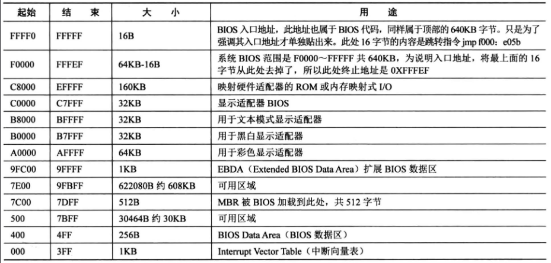

### 计算机启动过程

1、按下电源键

2、BIOS代码映射在内存 0xF0000 ~ 0xFFFFF

3、CPU的cs：ip寄存器被强制置为 0xF000: 0xFFF0 ---> 0xFFFF0，该地址处的指令为jmp f000：0xe05b ---> 0xfe05b，该位置是BIOS入口地址，BIOS代码开始执行，检测内存、显卡等外设信息，通过检测后，在内存 0x000 ~ 0x3FF处建立数据结构，中断向量表IVT并填写中断程序。

4、BIOS最后一项工作，检测启动盘中为 0 盘 0 道 1 扇区（CHS）的内容（是不是MBR程序）。如果最后两个字节是 0x55、0xaa，便将该扇区的代码加载到 0x7c00 处，使用         jmp 0：0x7c00指令跳转过去继续执行。


实模式下的 1M 内存分布




### MBR代码

```nasm
SECTION MBR vstart=0x7c00	;把MBR的起始地址编译为 0x7c00，若引用该 节 的变量，其地址都从 vstart定义的地址开始算（书 P69）
    mov ax, cs
    mov ds, ax
    mov es, ax
    mov ss, ax
    mov fs, ax
    mov sp, 0x7c00			; 把 0x7c00 一下地址当作栈来使用

; 清屏: 使用0x06号中断功能，上卷全部行，则可以清屏
; ---------------------------------------------
; INT 0x10  功能号 0x06     功能描述 上卷所有行
; ---------------------------------------------
; AH -> 功能号0x06
; AL = 上卷的行数(如果为0,表示全部)
; BH = 上卷行属性
; (CL,CH) = 窗口左上角的(X,Y)位置
; (DL,DH) = 窗口右下角的(X,Y)位置
; 无返回值
    mov ax, 0x600
    mov bx, 0x70
    mov cx, 0                   ; 左上角: (0, 0)
    mov dx, 0x184f              ; 右下角: (80,25)
                ; VGA文本模式中,一行只能容纳80个字符,共25行。
                ; 下标从0开始,所以0x18=24,0x4f=79
    int 0x10

; 获取光标位置
; ---------------------------------------------
; INT 0x10  功能号 0x03     功能描述 获取光标位置
; ---------------------------------------------
; 获取当前光标位置,在光标位置处打印字符.
   mov ah, 3		; 输入: 3号子功能是获取光标位置,需要存入ah寄存器
   mov bh, 0		; bh寄存器存储的是待获取光标的页号

   int 0x10		    ; 输出: ch=光标开始行,cl=光标结束行
			        ; dh=光标所在行号,dl=光标所在列号

; 打印字符串
; ---------------------------------------------
; INT 0x10  功能号 0x13     功能描述 打印字符串
; ---------------------------------------------
    mov ax, message 
    mov bp, ax		; es:bp 为串首地址, es此时同cs一致，
			        ; 开头时已经为sreg初始化

    ; 光标位置要用到dx寄存器中内容,cx中的光标位置可忽略
    mov cx, 5		; cx 为串长度,不包括结束符0的字符个数
    mov ax, 0x1301	; 子功能号13是显示字符及属性,要存入ah寄存器,
					; al设置写字符方式 ah=01: 显示字符串,光标跟随移动
    mov bx, 0x2		; bh存储要显示的页号,此处是第0页,
			; bl中是字符属性, 属性黑底绿字(bl = 02h)
    int 0x10		; 执行BIOS 0x10 号中断


    jmp $		; 使程序悬停在此

    message db "1 MBR"
    times 510-($-$$) db 0
    db 0x55,0xaa
```

- 代码解释

```nasm
    mov ax, cs
    mov ds, ax
    mov es, ax
    mov ss, ax
    mov fs, ax
    mov sp, 0x7c00
用 cs 寄存器的值去初始化其他寄存器 。 由于 BIOS 是通过 jmp 0:0x7c00 跳转到 MBR 的，故cs 此时为 0 。 对于ds、 es、 fs、gs 这类 sreg，CPU 中不能直接给它们赋值，没有从立即数到段寄存器的电路实现，只有通过其他寄存器来中转，这里我们用的是通用寄存器 ax 来中转。
```

```nasm
; 获取光标位置
; ---------------------------------------------
; INT 0x10  功能号 0x03     功能描述 获取光标位置
; ---------------------------------------------
; 获取当前光标位置,在光标位置处打印字符.
   mov ah, 3		; 输入: 3号子功能是获取光标位置,需要存入ah寄存器
   mov bh, 0		; bh寄存器存储的是待获取光标的页号

   int 0x10		    ; 输出: ch=光标开始行,cl=光标结束行
			        ; dh=光标所在行号,dl=光标所在列号

一页就是一屏，一屏可以有80列25行、40列25行等字符，默认情况是80*25的显示方式，共2000个字符，一个字符要两字节控制，高字节控制字符属性，低字节表示ASCII码，一屏就要4000个字节，但实际分配是4K，0页是默认页
```

```nasm
; 打印字符串
; ---------------------------------------------
; INT 0x10  功能号 0x13     功能描述 打印字符串
; ---------------------------------------------
    mov ax, message 
    mov bp, ax		; es:bp 为串首地址, es此时同cs一致，
			        ; 开头时已经为sreg初始化

    ; 光标位置要用到dx寄存器中内容,cx中的光标位置可忽略
    mov cx, 5		; cx 为串长度,不包括结束符0的字符个数
    mov ax, 0x1301	; 子功能号13是显示字符及属性,要存入ah寄存器,
					; al设置写字符方式 ah=01: 显示字符串,光标跟随移动
    mov bx, 0x2		; bh存储要显示的页号,此处是第0页,
			; bl中是字符属性, 属性黑底绿字(bl = 02h)
    int 0x10		; 执行BIOS 0x10 号中断

只有写字符时，al低两位才有意义
al=0 ，显示字符串，并且光标返回起始位置。
al=1 ，显示字符串，并且光标跟随到新位置。
al=2 ，显示字符串及其属性，并且光标返回起始位置 。
al=3 ，显示字符串及其属性，光标跟随到新位置。
```


### 编译MBR，写入启动盘

- 编译

```shell
nasm -o mbr.bin mbr.S
```

nasm 还有 -f 参数，可以编译除了纯二进制文件，还可以是elf，coff，WIN等格式

- 写入磁盘

```shell
dd if=/home/ubuntu/mos/01_mbr/mbr.bin of=hd60M.img bs=512 count=1 conv=notrunc
```

